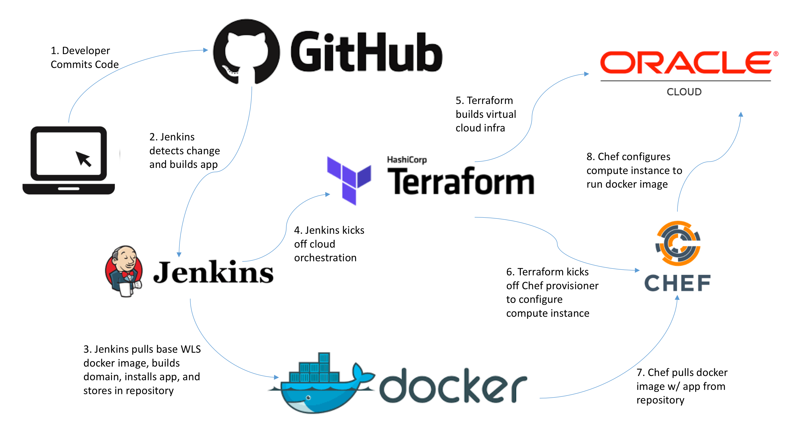

# Java EE Infrastructure as Code (IaC) Sample
Ed Shnekendorf, Cloud Platform Architect, Oracle

## Overview
This repository provides the code used to demonstrate IaC concepts using Docker, Jenkins, and Weblogic Server.  It is meant to be used in conjunction with the [Terraform/Chef Sample](https://github.com/eshneken/terraform-bmcs-weblogic-jenkins-chef) to provide an end-to-end automation sample that implements the following architecture:

This project encapsulates steps 1-3 while the [Terraform/Chef Sample](https://github.com/eshneken/terraform-bmcs-weblogic-jenkins-chef) project handles steps 4-8.

This project leverages the private docker repository and Jenkins server/jobs that are set up as part of that project so start there first before setting this up